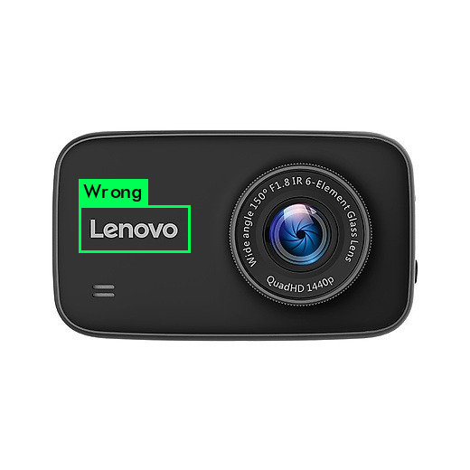

# Lenovo logo image validation using object detection technology (YOLOv3 & CVTK)

## Scenario

Lenovo is facing the problem of invalid logo everywhere. The problem includes three parts:

1. They designed a new version of logo to replace the old one. So they want to detect the old logo in the image.

- Valid logo: 
<p align="center">

- Old logo:
<p align="center">

2. The new logo must have a colorful background with a fixed ratio of length and width, and the characters of "Lenovo" should be white or transparent.

- Valid logo: 
<p align="center">
<p align="center">

- Invalid logo:
<p align="center">
<p align="center">
<p align="center">

3. The logo can be vertical or horizontal. When the logo is vertical, the order of "Lenovo" word should be from bottom to top. The other side will be wrong.

- Vertical logo: 
<p align="center">

Lenovo wanted to leverage computer vision, object detection and deep learning technology to detect the valid and invalid logo in any image. 

## Data

Lenovo provided 300 images as dataset, 80% as training data and 20% as validation data. There's three labels, including "new", "old" and "wrong". Label-wise object counts:
- Label New objects: 113 
- Label Old objects: 75 
- Label Wrong objects: 72 

## Technology

- Azure Windows and Ubuntu Data Science Virtual Machine(NC6)
- Yolov3
- Azure Machine Learning package for Computer Vision (CVTK)

## CVTK result

We used TF-FasterRCNN function in CVTK, with "faster_rcnn_resnet50_coco_2018_01_28" as the base model. Other parameters are:
- score threshold = 0.0         
- iou threshold = 0.5
- initial learning rate = 0.001

After 5000 steps of training, we got the AP reuslt:
- Old            : 0.97
- New            : 0.96
- Wrong          : 0.67
- Overall:       : 0.87

You can reference the code [lenovo_logo.ipynb](CVTK/lenovo_logo.ipynb) in CVTK folder. The [image_div.ipynb](CVTK/image_div.ipynb) file is used to generate train and test folder based on the train.txt and val.txt, in case you used VOTT tool to label the datasets.

Detection results of samples:

<p align="center">
<p align="center">
<p align="center">
<p align="center">
<p align="center">

## YOLOv3 result

We downloaded "darknet53.conv.74" as base model. Other parameters are:
- batch = 16
- subdivisions = 8

After nearly 10,000 steps of training, we got the AP reuslt:
- Old            : 0.956597
- New            : 0.958400
- Wrong          : 0.704762
- Overall:       : 0.8732530423280421

You can reference the code [lenovo_logo.ipynb](YOLO/lenovo_logo.ipynb) in YOLO folder. The [Gentxt.py](YOLO/Gentxt.py) file is used to generate train.txt and val.txt based on label_train.txt and label_val.txt. Because YOLO requireds these two txts, and if you use VOTT tool, the txts are absence.

Detection results of samples:

<p align="center">
<p align="center">
<p align="center">
<p align="center">
<p align="center">

## Key Learning
- **CVTK trains very fast.** CVTK's 5000 steps only take 2360 seconds, and get the overall AP of 0.87. While yolo needs more than 4 hours, 9800 steps to get the overall AP of 0.87.

- **Training parameters affect not much.** CVTK's parameters score threshold and iou threshold don't affect the AP result much. More training steps work both for CVTK and YOLO.

- **More images are needed.** The right logo with transparent characters are always detected as invalid logo because of not enough training data. We need add more data of this scenarios.

- **How to detect the ratio of lengh and width of the logo's background?** Whether ratio of length and width of background of the logo is valid is difficult to detect, because real photos always have shape distortion. We need find suitable algorithms to get the right ratio of length and width.

- **CVTK installing issue with scikit-learn.** When install CVTK in the AML workbench in Windows DSVM, we may have the issue of scikit-learn installed (error info: it is a distutils installed project). This is because your item is installed with anaconda. Try below to uninstall the scikit-learn and run the CVTK setup command again. This will fix the issue.

```
    conda uninstall scikit-learn
```

## Object Detection Template based on Azure DSVM

We (with [Iamnvincible](https://github.com/Iamnvincible)) cooked a template to help develpers one click to deploy a NC6 Ubuntu Data Science Virtual Machine, with pre-installed Yolov3. When ready, you can just open the Jupyter Notebook and get the Yolo and RetinaNet code template. With labeled image dataset uploaded, we can just modify several parameters and run the training process.

https://github.com/THULiusj/Object_Detection_DSVM_template


